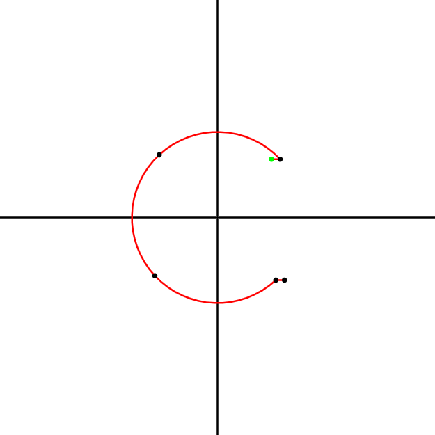

# Domains

Toy language to help experiment with numerical domains for abstract interpretation. The language is inspired by the following book:

```
  Rival, Xavier, and Kwangkeun Yi. Introduction to static analysis: an abstract interpretation perspective. Mit Press, 2020.
```

The goal is to build a framework that helps experimenting with numerical domains and static analysis methods to
infer which regions in the 2D space are reachable by the programs written in the graphical language.

# Example

Consider the following example program from the book:
```
init(50, 50, 50, 50);
translation(10, 0);
iter{
    { translation(10, 0) } or { rotation(0, 0, 90) }
}
```

Running `./domains example.tr --svg` will output the SVG to the standard output.
Rendering the SVG will produce a visualization of a possible execution of the input program.
An execution is defined as a random walk of the control flow graph.

## Example output:



# Dependencies

* Meson
* C++20 compatible compiler
* fmt
* cairo
